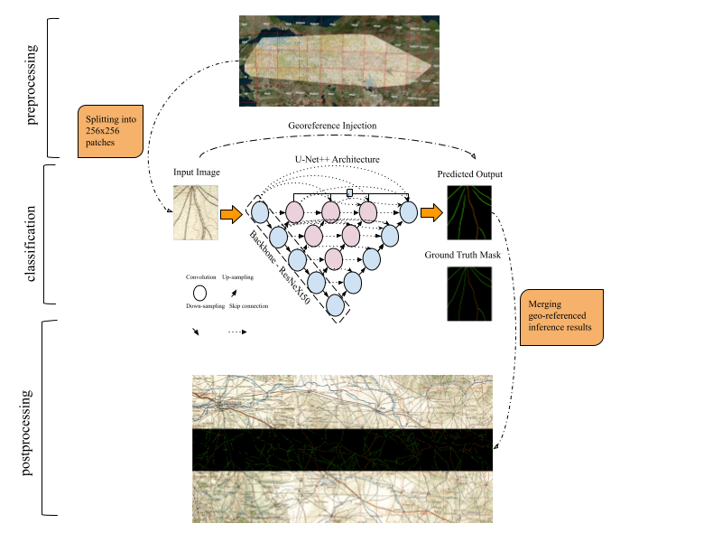

# Automatic-Road-Extraction-from-Historical-Maps-using-Deep-Learning-Techniques
This repository contains the code for the paper "Automatic Road Extraction from Historical Maps using Deep Learning Techniques: A Regional Case Study of Turkey in a German World War II map"

Overall workflow
---------------------

Usage and Reproducing 
---------------------

Modify the paths in the *config.py* script and run the *main.ipynb* notebook. It is also possible to run evaluation and inference parts of the notebook alone to reproduce the results stated in the paper. To do so, use the link below to get the data and the weights. 

The weights and the splitted dataset can be found at the following link:   
https://drive.google.com/drive/folders/1nTO_ux02-vh3p4R6fmzVF_8ZxfHvPkJb?usp=sharing

If you want to run the code in your own data, you can accordingly change the *config.py* file (e.g., data and ground truth paths, num_class) and tune the hyperparameters.

System-specific notes
---------------------

The code was implemented in Python(3.8) and PyTroch(1.14.0) on Windows OS. The *segmentation models pytorh* library is used . Apart from main data science libraries, RS-specific libraries such as GDAL, rasterio, and tifffile are used.  

Citation
---------------------

Please kindly cite the paper if this code is useful and helpful for your research.

*TBD*

Contact Information
--------------------
If you encounter the bugs while using this code, please do not hesitate to contact us.
Burak Ekim (ekim19@itu.edu.tr)
